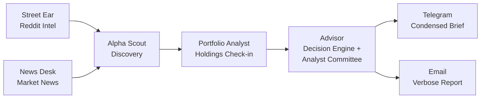

# AlphaDesk

**Multi-agent investment intelligence that replaces 2 hours of daily research with a single Telegram briefing.**

Five AI agents scan Reddit, news, your portfolio, the broader market, and macro/conviction signals — then an analyst committee synthesizes everything into an actionable daily brief delivered via Telegram and email.

## How It Works



**Phase 1** — Street Ear + News Desk scan Reddit and news in parallel, publishing signals to the agent bus.
**Phase 2** — Alpha Scout discovers new tickers via multi-dimensional screening.
**Phase 3** — Portfolio Analyst runs technicals, fundamentals, and risk analysis on your holdings.
**Phase 4** — Advisor synthesizes everything through a decision engine (conviction, moonshot, strategy) and a 4-analyst committee (Growth, Value, Risk, CIO Editor).
**Phase 5** — Delivery: condensed brief to Telegram, full verbose report to email.

## Agents

| Agent | Role | Data Sources | Key Output |
|-------|------|-------------|------------|
| **Street Ear** | Reddit intelligence | r/wallstreetbets, r/investing, r/stocks | Unusual mentions, sentiment reversals, narrative formation |
| **News Desk** | Market news analysis | Finnhub, NewsAPI | Scored headlines, macro events, sector news |
| **Alpha Scout** | Ticker discovery | All agents + screening | Buy/watch recommendations with investment theses |
| **Portfolio Analyst** | Holdings analysis | yfinance, agent bus signals | Technicals, fundamentals, risk metrics |
| **Advisor** | Investment synthesis | All of the above + memory | 5-section daily brief with actions |

### v2 Sub-Agents (Analyst Committee)

| Sub-Agent | Perspective | Produces |
|-----------|------------|----------|
| **Growth Analyst** | Revenue acceleration, TAM, competitive moats | Growth scores, catalysts, moat assessment |
| **Value Analyst** | Valuation, margin of safety, capital allocation | Value scores, regime classification, fair value |
| **Risk Officer** | Correlation, concentration, drawdown scenarios | Risk flags, max drawdown scenario, correlation warnings |
| **Skeptic Agent** | Adversarial challenge to every recommendation | Confidence modifier, invalidation conditions, base rates |
| **Delta Engine** | Day-over-day change detection | High/medium/low significance changes |
| **Catalyst Tracker** | Event calendar (FOMC, CPI, earnings) | Next 30 days of catalysts with impact estimates |

## Quick Start

### 1. Clone and install

```bash
git clone <your-repo-url> alphadesk
cd alphadesk
pip install -r requirements.txt
```

### 2. Configure environment

```bash
cp .env.example .env
```

Edit `.env` with your keys:

```env
# Required
ANTHROPIC_API_KEY=sk-ant-...
TELEGRAM_BOT_TOKEN=123456:ABC-DEF...
TELEGRAM_CHAT_ID=your_numeric_chat_id

# News (at least one recommended)
FINNHUB_API_KEY=your_finnhub_key
NEWSAPI_KEY=your_newsapi_key

# Advisor layer
FRED_API_KEY=your_fred_key
FMP_API_KEY=your_fmp_key
KALSHI_API_KEY=your_kalshi_key

# Email delivery (optional)
# SMTP_HOST=smtp.gmail.com
# SMTP_PORT=587
# SMTP_USER=your_email@gmail.com
# SMTP_PASS=your_app_password
# REPORT_EMAIL_TO=recipient@example.com
```

### 3. Configure your portfolio

Edit `config/advisor.yaml` with your holdings, macro theses, and strategy parameters. You can also create `private/portfolio.yaml` to keep holdings out of version control:

```yaml
holdings:
  - ticker: NVDA
    category: core
    thesis: "AI CapEx beneficiary — dominant GPU franchise"
    shares: 100
    entry_price: 95.00
  - ticker: AMZN
    category: core
    thesis: "AWS re-acceleration + retail margin expansion"
    shares: 50
    entry_price: 160.00
```

### 4. First run

```bash
# Full advisor brief (one-shot)
python -c "import asyncio; from src.advisor.main import run; asyncio.run(run())"

# Or start the Telegram bot (long-running with daily schedule)
python -m src.shared.telegram_bot
```

## Configuration

| File | Purpose |
|------|---------|
| `config/advisor.yaml` | Holdings, macro theses, strategy params, v2 settings |
| `config/portfolio.yaml` | Holdings with shares and cost basis |
| `config/watchlist.yaml` | Additional tickers to track |
| `config/scout.yaml` | Alpha Scout screening parameters |
| `config/subreddits.yaml` | Reddit sources for Street Ear |
| `private/portfolio.yaml` | Private holdings override (git-ignored) |
| `.env` | API keys and secrets (git-ignored) |

## Sample Output

```
☀️ ALPHADESK DAILY BRIEF — Feb 22, 2026
━━━━━━━━━━━━━━━━━━━━━━━━━━━━━━━━━━━

**SECTION 1 - WHAT CHANGED TODAY**
Quiet day — VIX at 14.5, 10Y at 4.25%. NVDA up 2.3% on
continued CapEx guidance from MSFT earnings call. No thesis
changes.

**SECTION 2 - ANALYST CONSENSUS & DISAGREEMENTS**
• Growth and Value agree: NVDA remains best risk-reward in semis
• Risk Officer flags 65% portfolio exposure to AI CapEx narrative
• Value Analyst says AVGO is stretched at 38x forward P/E

**SECTION 3 - ACTIONS**
No action. All theses intact.

**SECTION 4 - WHAT TO WATCH THIS WEEK**
• FOMC minutes Wednesday — watch for rate cut language
• NVDA earnings Thursday — CapEx thesis validation

**SECTION 5 - PORTFOLIO HEALTH**
Risk score: 42/100. Concentration in semis/AI remains primary concern.
━━━━━━━━━━━━━━━━━━━━━━━━━━━━━━━━━━━
AlphaDesk v2.0 | $3.42 today
```

## Cost Estimate

| Mode | Estimated Cost | What It Does |
|------|---------------|--------------|
| Full daily brief | ~$3-5/day | All agents + analyst committee + synthesis |
| Individual command | ~$0.10 | Single section (e.g., `/holdings`, `/macro`) |
| Backtest (5 days) | ~$3-4 | Full pipeline replay with real LLM calls |
| Backtest (skip committee) | ~$0.10-0.50 | Rule-based engines only, near-zero API cost |
| Weekly retrospective | ~$0.50 | Self-assessment + pattern analysis |

Default daily cap: **$20** (configurable via `DAILY_COST_CAP` in `.env`). When exceeded, synthesis steps are skipped and raw data is delivered.

## Telegram Commands

### Advisor

| Command | Description |
|---------|-------------|
| `/advisor` | Full daily brief (analyst committee + all sections) |
| `/holdings` | Portfolio check-in with P&L |
| `/macro` | Macro & market context |
| `/conviction` | Conviction list (top 3-5 names) |
| `/moonshot` | Moonshot ideas (1-2 asymmetric bets) |
| `/action` | Strategy actions (add/trim/hold) |

### v2 Intelligence

| Command | Description |
|---------|-------------|
| `/delta` | What changed since yesterday |
| `/catalysts` | Upcoming catalysts (30d calendar) |
| `/scorecard` | Recommendation track record |
| `/retro` | Weekly retrospective & self-assessment |
| `/report` | Latest verbose report file path |

### Core Agents

| Command | Description |
|---------|-------------|
| `/brief` | Full morning briefing (all agents + synthesis) |
| `/portfolio` | Portfolio analysis only |
| `/news` | Market news only |
| `/trending` | Reddit intelligence only |
| `/discover` | Alpha Scout ticker discovery |

### System

| Command | Description |
|---------|-------------|
| `/cost` | API cost report for today |
| `/status` | System status and recent signals |
| `/help` | List all available commands |

## Backtesting

Replay the full pipeline against historical data to validate signal quality:

```bash
# Quick backtest (skip LLM calls, near-zero cost)
python -m src.backtest --days 5 --skip-committee

# Full backtest with analyst committee (~$3-4)
python -m src.backtest --days 5

# Custom portfolio
python -m src.backtest --days 10 --portfolio private/portfolio.yaml

# Dry run (show config, estimate cost)
python -m src.backtest --days 30 --dry-run
```

Output: `backtests/{date}/results.json`, `summary.md`, `signals.csv` with per-agent hit rates, confusion matrices, and forward-looking returns.

## Email Reports

Full verbose investment memos delivered via email with sparkline charts and color-coded tables:

```bash
# Preview today's report in browser
python -m src.report --preview

# Send via email
python -m src.report --channel email

# Send a specific date
python -m src.report --channel email --date 2026-02-22
```

Verbose reports are auto-generated on every `/advisor` run and saved to `reports/{date}/full_report.md` + `full_report.html`.

## Project Structure

```
alphadesk/
├── config/
│   ├── advisor.yaml            # Holdings, theses, strategy, v2 settings
│   ├── portfolio.yaml          # Holdings with shares + cost basis
│   ├── watchlist.yaml          # Additional tickers to track
│   ├── scout.yaml              # Alpha Scout screening config
│   └── subreddits.yaml         # Reddit sources for Street Ear
├── src/
│   ├── advisor/                # Investment advisor (24 modules)
│   │   ├── main.py             # Pipeline orchestrator
│   │   ├── memory.py           # SQLite persistent memory
│   │   ├── formatter.py        # Telegram output formatter
│   │   ├── verbose_formatter.py # Full investment memo generator
│   │   ├── analyst_committee.py # Growth + Value + Risk + CIO synthesis
│   │   ├── skeptic_agent.py    # Adversarial recommendation testing
│   │   ├── delta_engine.py     # Day-over-day change detection
│   │   ├── catalyst_tracker.py # Event calendar (FOMC, CPI, earnings)
│   │   ├── conviction_manager.py # 5-source evidence-based conviction list
│   │   ├── moonshot_manager.py # Asymmetric bet tracking
│   │   ├── strategy_engine.py  # Add/trim/hold recommendations
│   │   ├── valuation_engine.py # DCF-based target prices
│   │   ├── macro_analyst.py    # FRED macro indicators + thesis testing
│   │   ├── holdings_monitor.py # Daily holdings check-in with memory
│   │   ├── earnings_analyzer.py # Earnings calls + management guidance
│   │   ├── prediction_market.py # Polymarket + Kalshi crowd sentiment
│   │   ├── superinvestor_tracker.py # 13F filings + insider activity
│   │   ├── outcome_scorer.py   # Recommendation track record
│   │   └── retrospective.py    # Weekly self-assessment
│   ├── street_ear/             # Reddit intelligence agent
│   │   ├── main.py
│   │   ├── reddit_fetcher.py
│   │   ├── analyzer.py
│   │   ├── tracker.py
│   │   └── formatter.py
│   ├── news_desk/              # News intelligence agent
│   │   ├── main.py
│   │   ├── news_fetcher.py
│   │   ├── analyzer.py
│   │   └── formatter.py
│   ├── portfolio_analyst/      # Portfolio analysis agent
│   │   ├── main.py
│   │   ├── price_fetcher.py
│   │   ├── technical_analyzer.py
│   │   ├── fundamental_analyzer.py
│   │   ├── risk_analyzer.py
│   │   └── formatter.py
│   ├── alpha_scout/            # Ticker discovery agent
│   │   ├── main.py
│   │   ├── candidate_sourcer.py
│   │   ├── screener.py
│   │   ├── synthesizer.py
│   │   └── formatter.py
│   ├── backtest/               # Backtesting framework
│   │   ├── __main__.py         # CLI: python -m src.backtest
│   │   ├── runner.py           # Multi-day orchestrator
│   │   ├── data_replay.py      # Historical data provider
│   │   ├── signal_capture.py   # Pipeline signal hooks
│   │   ├── outcome_tracker.py  # Forward-looking return computation
│   │   ├── report_generator.py # JSON + Markdown + CSV output
│   │   └── db_isolation.py     # Temp DB context for safe replay
│   ├── report/                 # Report delivery CLI
│   │   └── __main__.py         # CLI: python -m src.report
│   ├── shared/                 # Cross-agent infrastructure
│   │   ├── agent_bus.py        # SQLite pub/sub for inter-agent signals
│   │   ├── config_loader.py    # YAML config loading
│   │   ├── cost_tracker.py     # API cost tracking with budget cap
│   │   ├── morning_brief.py    # Legacy orchestrator
│   │   ├── telegram_bot.py     # Bot commands + scheduling
│   │   ├── email_reporter.py   # SMTP email delivery
│   │   ├── report_generator.py # HTML report with sparklines
│   │   ├── security.py         # Env validation, input sanitization
│   │   └── schemas.py          # Shared data schemas
│   └── utils/
│       ├── logger.py           # Structured logging
│       └── cleanup.py          # Data cleanup utilities
├── tests/
│   ├── backtest_historic.py    # Full pipeline backtest (5 days)
│   ├── simulate_week.py        # Week simulation test
│   └── test_full_pipeline_simulation.py
├── Dockerfile
├── docker-compose.yaml
├── requirements.txt
├── .env.example
└── README.md
```

## API Keys

| Key | Required | Source | What It Powers |
|-----|----------|--------|---------------|
| `ANTHROPIC_API_KEY` | Yes | [console.anthropic.com](https://console.anthropic.com/) | All Claude Opus 4.6 analysis |
| `TELEGRAM_BOT_TOKEN` | Yes | [BotFather](https://t.me/BotFather) | Daily brief delivery |
| `TELEGRAM_CHAT_ID` | Yes | See setup guide | Message routing |
| `FINNHUB_API_KEY` | Recommended | [finnhub.io](https://finnhub.io/) | Company news per ticker |
| `NEWSAPI_KEY` | Recommended | [newsapi.org](https://newsapi.org/) | Market headlines |
| `FRED_API_KEY` | Recommended | [fred.stlouisfed.org](https://fred.stlouisfed.org/docs/api/api_key.html) | Macro indicators (rates, yield curve) |
| `FMP_API_KEY` | Optional | [financialmodelingprep.com](https://site.financialmodelingprep.com/) | Earnings transcripts + guidance |
| `KALSHI_API_KEY` | Optional | [kalshi.com](https://kalshi.com/) | Prediction market data |
| `SMTP_USER` | Optional | Your email provider | Email report delivery |
| `SMTP_PASS` | Optional | Your email provider | Email report delivery |
| `REPORT_EMAIL_TO` | Optional | — | Email recipient address |

## Running on a Schedule

### Option A: Telegram bot (recommended)

The built-in scheduler fires the Advisor briefing daily at 07:00 and sends email reports when configured:

```bash
python -m src.shared.telegram_bot
```

### Option B: Docker

```bash
docker compose up -d
```

### Option C: systemd (Linux)

```ini
[Unit]
Description=AlphaDesk Telegram Bot
After=network.target

[Service]
Type=simple
User=your_user
WorkingDirectory=/path/to/alphadesk
ExecStart=/path/to/python -m src.shared.telegram_bot
Restart=on-failure
RestartSec=10

[Install]
WantedBy=multi-user.target
```

## Roadmap

### Built

- [x] 5 AI agents with SQLite agent bus
- [x] Analyst committee (Growth + Value + Risk + CIO Editor)
- [x] Delta engine (day-over-day change detection)
- [x] Catalyst tracker (FOMC, CPI, earnings calendar)
- [x] Skeptic agent (adversarial recommendation testing)
- [x] Conviction pipeline (5-source evidence testing + 25% CAGR gate)
- [x] Moonshot manager (disruptors, catalyst plays, turnarounds)
- [x] Outcome tracking + weekly retrospective
- [x] Backtesting framework with per-agent metrics
- [x] Verbose investment memos (Markdown + HTML)
- [x] Email delivery with sparkline charts
- [x] Prediction market integration (Polymarket + Kalshi)
- [x] Superinvestor tracking (13F filings)

### Planned

- [ ] Correlation risk analysis (portfolio-level thesis concentration)
- [ ] Position sizing guidance (target weight recommendations)
- [ ] Tax-lot awareness (hold period before trim recs)
- [ ] Substack + YouTube integration
- [ ] Web dashboard for report browsing

## License

MIT
