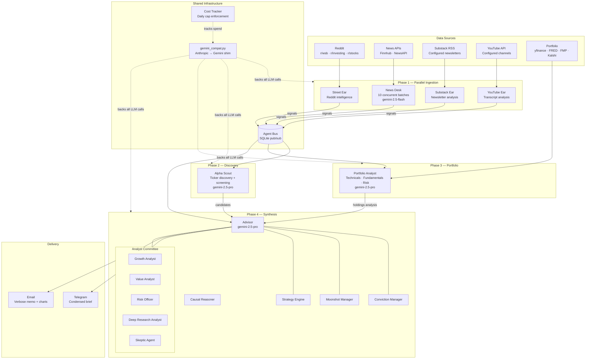

# AlphaDesk

**Multi-agent investment intelligence that replaces 2 hours of daily research with a single Telegram briefing.**

Seven AI agents scan Reddit, news, Substack, YouTube, your portfolio, the broader market, and macro/conviction signals — then a synthesis layer produces an actionable daily brief delivered via Telegram.

## Architecture



**Typical runtime:** morning full ~5 minutes, evening wrap <2 minutes, weekend review <2 minutes.
**Typical cost:** morning full ~$9-12, evening wrap ~$1-3, weekend review ~$1-2.

## LLM Backend

AlphaDesk uses **Google Gemini** via an Anthropic-compatible shim (`src/shared/gemini_compat.py`). All agent code calls the standard `anthropic` SDK interface; the shim routes to the right Gemini model automatically.

| Claude tier called by agents | Gemini model used | Thinking |
|---|---|---|
| `claude-haiku-*` | `gemini-2.5-flash` | Disabled (`budget=0`) — fast JSON extraction |
| `claude-sonnet-*` | `gemini-2.5-pro` | Capped at 512 tokens |
| `claude-opus-*` | `gemini-2.5-pro` | Capped at 512 tokens |

> **Why thinking is capped:** Gemini 2.5 Pro runs a mandatory thinking phase that shares the `max_output_tokens` budget. Without a cap, thinking can consume the entire budget and produce empty visible output.

## Agents

| Agent | Role | Data Sources | Key Output |
|-------|------|-------------|------------|
| **Street Ear** | Reddit intelligence | r/wallstreetbets, r/investing, r/stocks | Unusual mentions, sentiment reversals, narrative formation |
| **News Desk** | Market news analysis | Finnhub, NewsAPI | Scored headlines, macro events, sector news |
| **Substack Ear** | Long-form newsletter analysis | Configured Substack feeds | Analyst theses, deep-dive summaries |
| **YouTube Ear** | Finance video transcripts | Configured YouTube channels | Video summaries, key insights from creators |
| **Alpha Scout** | Ticker discovery | All agents + screening | Buy/watch recommendations with investment theses |
| **Portfolio Analyst** | Holdings analysis | yfinance, agent bus signals | Technicals, fundamentals, risk metrics |
| **Advisor** | Investment synthesis | All of the above + memory | 7-section daily brief with deep research blocks |

### Analyst Committee (inside Advisor)

| Sub-Agent | Perspective | Produces |
|-----------|------------|----------|
| **Growth Analyst** | Revenue acceleration, TAM, competitive moats | Growth scores, catalysts, moat assessment |
| **Value Analyst** | Valuation, margin of safety, capital allocation | Value scores, regime classification, fair value |
| **Risk Officer** | Correlation, concentration, drawdown scenarios | Risk flags, max drawdown scenario, correlation warnings |
| **Deep Research Analyst** | 10-section research note per priority ticker | Thesis scorecards, signal→interpretation chains, bull/bear/base |
| **Causal Reasoner** | Second-order effects, cross-stock read-throughs | Assumption chains with confidence estimates |
| **Skeptic Agent** | Adversarial challenge to every recommendation | Confidence modifier, invalidation conditions, base rates |
| **Delta Engine** | Day-over-day change detection | High/medium/low significance changes |
| **Catalyst Tracker** | Event calendar (FOMC, CPI, earnings) | Next 30 days of catalysts with impact estimates |

### Deep Research Pipeline

Priority tickers now run through a multi-step research flow rather than a single synthesis call:

1. **Plan** — research tasks are ranked by information density, uncertainty, and conflicting signals
2. **Gather** — fetch top article bodies, memory context, and related signals
3. **Analyze** — identify contradictions, second-order effects, and explicit data gaps
4. **Fill gaps** — resolve missing competitor/fundamental context and pull late-arriving signals
5. **Synthesize** — produce the final deep research block with citations

This improves the old headlines-only deep research path by letting the system read article bodies, cross-validate evidence, and degrade gracefully if one research step fails.

### CIO Brief Format

The editor/CIO synthesizes all analyst views into a 7-section memo:

1. **Executive Take** — 3-bullet action-oriented summary
2. **Theme Dashboard** — Evidence-based status (Strengthening/Stable/Weakening/Broken) with confidence scores
3. **Portfolio Actions** — Specific trades with sizing rationale
4. **Cross-Asset / Macro Risks** — Correlation, contagion, and tail risk
5. **Thesis Breakers** — What evidence would invalidate current theses
6. **Upcoming Catalysts** — Next 7 days with expected impact
7. **Analyst Consensus & Disagreements** — Where Growth/Value/Risk agree and disagree

## Quick Start

### 1. Clone and install

```bash
git clone <your-repo-url> alphadesk
cd alphadesk
python3 -m venv .venv
source .venv/bin/activate
python -m pip install --upgrade pip
python -m pip install -r requirements.txt
```

### 2. Configure environment

```bash
cp .env.example .env
```

Edit `.env` with your keys:

```env
# Required
GEMINI_API_KEY=AIza...
TELEGRAM_BOT_TOKEN=123456:ABC-DEF...
TELEGRAM_CHAT_ID=your_numeric_chat_id

# News (at least one recommended)
FINNHUB_API_KEY=your_finnhub_key
NEWSAPI_KEY=your_newsapi_key

# Advisor layer
FRED_API_KEY=your_fred_key
FMP_API_KEY=your_fmp_key
KALSHI_API_KEY=your_kalshi_key

# YouTube Ear (optional)
YOUTUBE_API_KEY=your_youtube_data_api_v3_key

# Daily spend cap (default $20)
DAILY_COST_CAP=20.00
```

### 3. Configure your portfolio

Edit `config/advisor.yaml` with your holdings, macro theses, and strategy parameters. You can also create `private/portfolio.yaml` to keep holdings out of version control:

```yaml
holdings:
  - ticker: NVDA
    category: core
    thesis: "AI CapEx beneficiary — dominant GPU franchise"
    shares: 100
    entry_price: 95.00
  - ticker: AMZN
    category: core
    thesis: "AWS re-acceleration + retail margin expansion"
    shares: 50
    entry_price: 160.00
```

### 4. Configure content sources

**YouTube channels** (`config/youtube_channels.yaml`):
```yaml
max_video_age_hours: 48
channels:
  - name: Patrick Boyle
    channel_id: UCM45lRp6mfZMF1dSITOIqUQ
  - name: The Plain Bagel
    channel_id: UCFCEuCsyWP0YkP3CZ3Mr01Q
```

**Substack feeds** (`config/substack_feeds.yaml`): add the RSS URLs of newsletters you follow.

### 5. First run

```bash
# Auto-select run type from config/schedule
python run_daily.py --run-type=auto

# Full morning brief
python run_daily.py --run-type=morning_full

# Evening wrap
python run_daily.py --run-type=evening_wrap

# Weekend review
python run_daily.py --run-type=weekend

# Or start the Telegram bot (long-running with daily schedule)
python -m src.shared.telegram_bot
```

## Run Profiles

| Run Type | Intended Time | Scope | Delivery |
|---|---|---|---|
| `morning_full` | 07:00 market days | Full 10-step advisor pipeline + analyst committee + verbose report | Telegram + optional email |
| `evening_wrap` | 19:00 market days | Headlines-only news, closing prices, delta vs morning, Flash delta analyst | Telegram |
| `weekend` | 10:00 Saturday | Thesis review, run history summary, next-week catalysts | Telegram |

The active schedule lives in `config/advisor.yaml` under `schedule:` and drives both `determine_run_profile()` and the Telegram scheduler fallback.

## Configuration

| File | Purpose |
|------|---------|
| `config/advisor.yaml` | Holdings, macro theses, strategy params, multi-run schedule |
| `config/portfolio.yaml` | Holdings with shares and cost basis |
| `config/watchlist.yaml` | Additional tickers to track |
| `config/scout.yaml` | Alpha Scout screening parameters |
| `config/subreddits.yaml` | Reddit sources for Street Ear |
| `config/youtube_channels.yaml` | YouTube channels for YouTube Ear |
| `config/substack_feeds.yaml` | Substack RSS feeds for Substack Ear |
| `private/portfolio.yaml` | Private holdings override (git-ignored) |
| `.env` | API keys and secrets (git-ignored) |

## Sample Output

**Telegram brief** (condensed):
```
☀️ ALPHADESK DAILY BRIEF — Mar 08, 2026
━━━━━━━━━━━━━━━━━━━━━━━━━━━━━━━━━━━

💬 TODAY'S TAKE
  Geopolitical shocks test conviction. MRVL +18% divergence
  on export control read-through. Trimming META overexposure.

  • Hold MRVL — thesis strengthening, custom silicon tailwind
  • Trim META to 15% — mechanical overweight, not conviction change
  • Monitor 50% "Fed Easing" concentration into CPI Mar 12

📊 YOUR PORTFOLIO
  Total: $2,504 | Today: $-24
  ⚡ MOVING: META -2.4% | AMZN -2.6% | NVDA -3.0%
  🟢 MRVL +18.4% (custom silicon beneficiary of export controls)
━━━━━━━━━━━━━━━━━━━━━━━━━━━━━━━━━━━
AlphaDesk v2.0 | $7.82 today
```

**Email report** includes: full CIO memo, deep research blocks for each priority ticker (10-section structured notes), thesis scorecards with confidence scores, cross-stock read-throughs, and interactive HTML formatting.

## Cost Estimate

| Mode | Estimated Cost | Notes |
|------|---------------|-------|
| Full daily brief | ~$7–10/run | News Desk + deep research analyst are the main drivers |
| Individual command | ~$0.10–0.50 | Single section (e.g., `/holdings`, `/macro`) |
| Backtest (5 days) | ~$4–6 | Full pipeline replay with real LLM calls |
| Backtest (skip committee) | ~$0.10–0.50 | Rule-based engines only, near-zero API cost |
| Weekly retrospective | ~$0.50 | Self-assessment + pattern analysis |

**Model pricing used:**

| Model | Input | Output |
|-------|-------|--------|
| `gemini-2.5-pro` | $1.25 / M tokens | $10.00 / M tokens |
| `gemini-2.5-flash` | $0.075 / M tokens | $0.30 / M tokens |

Default daily cap: **$20** (configurable via `DAILY_COST_CAP` in `.env`). When exceeded, synthesis steps are skipped and raw data is delivered.

## Pipeline Timing

| Phase | Agent(s) | Typical Time |
|-------|----------|-------------|
| Phase 1 | Street Ear + News Desk + Substack Ear + YouTube Ear (parallel) | ~135s |
| Phase 2 | Alpha Scout | ~20s |
| Phase 3 | Portfolio Analyst | ~15s |
| Phase 4 | Advisor synthesis + deep research | ~100s |
| **Total** | | **~5 minutes** |

**News Desk and deep research are the bottlenecks.** News Desk splits articles into batches of 5 and calls Gemini 2.5 Flash concurrently (up to 10 workers). Deep research produces structured 10-section notes for up to 6 tickers in a single ~8000-token Pro call. The causal reasoner and gap resolver run in parallel with deep research.

## Telegram Commands

### Morning Brief

| Command | Description |
|---------|-------------|
| `/brief` | Full morning briefing (all agents + synthesis) |
| `/news` | Market news only |
| `/trending` | Reddit intelligence only |
| `/discover` | Alpha Scout ticker discovery |
| `/portfolio` | Portfolio analysis only |

### Advisor

| Command | Description |
|---------|-------------|
| `/advisor` | Full daily brief (analyst committee + all sections) |
| `/holdings` | Portfolio check-in with P&L |
| `/macro` | Macro & market context |
| `/conviction` | Conviction list (top 3-5 names) |
| `/moonshot` | Moonshot ideas (1-2 asymmetric bets) |
| `/action` | Strategy actions (add/trim/hold) |

### Intelligence

| Command | Description |
|---------|-------------|
| `/delta` | What changed since yesterday |
| `/catalysts` | Upcoming catalysts (30d calendar) |
| `/scorecard` | Recommendation track record |
| `/retro` | Weekly retrospective & self-assessment |
| `/report` | Latest verbose report file path |
| `/runs` | Recent run history (type, cost, duration) |

### Feedback

| Command | Description |
|---------|-------------|
| `/rate` | Rate today's brief (great/good/ok/bad) |
| `/feedback` | Free-text feedback for the AI |
| `/prefer` | Set analysis preferences |
| `/missed` | Report a missed signal |

### Chat

Type any question (without `/`) to ask about today's brief — the AI has full context of the daily analysis and can answer follow-up questions.

### System

| Command | Description |
|---------|-------------|
| `/cost` | API cost report for today |
| `/status` | System status and recent signals |
| `/help` | List all available commands |

## Project Structure

```
alphadesk/
├── config/
│   ├── advisor.yaml            # Holdings, theses, strategy, v2 settings
│   ├── portfolio.yaml          # Holdings with shares + cost basis
│   ├── watchlist.yaml          # Additional tickers to track
│   ├── scout.yaml              # Alpha Scout screening config
│   ├── subreddits.yaml         # Reddit sources for Street Ear
│   ├── youtube_channels.yaml   # YouTube channels for YouTube Ear
│   └── substack_feeds.yaml     # Substack RSS feeds
├── src/
│   ├── advisor/                # Investment advisor (30 modules)
│   │   ├── main.py             # Public advisor entrypoint
│   │   ├── run_orchestrator.py # Morning/evening/weekend execution router
│   │   ├── run_profile.py      # Schedule-driven run classification
│   │   ├── memory.py           # SQLite persistent memory
│   │   ├── formatter.py        # Telegram output formatter
│   │   ├── verbose_formatter.py # Full investment memo generator
│   │   ├── analyst_committee.py # Growth + Value + Risk + Deep Research + CIO synthesis
│   │   ├── research_planner.py # Planner for multi-step deep research
│   │   ├── deep_researcher.py  # Iterative search/fetch/analyze/synthesize research engine
│   │   ├── causal_reasoner.py  # Second-order effects & cross-stock read-throughs
│   │   ├── gap_resolver.py     # Resolves data gaps identified by analysts
│   │   ├── event_detector.py   # LLM-powered event extraction from news
│   │   ├── reasoning_journal.py # Tracks reasoning chains for audit trail
│   │   ├── chat_session.py     # Telegram Q&A session with brief context
│   │   ├── feedback_manager.py # User feedback collection and preference learning
│   │   ├── skeptic_agent.py    # Adversarial recommendation testing
│   │   ├── delta_engine.py     # Day-over-day change detection
│   │   ├── catalyst_tracker.py # Event calendar (FOMC, CPI, earnings)
│   │   ├── conviction_manager.py # 5-source evidence-based conviction list
│   │   ├── moonshot_manager.py # Asymmetric bet tracking
│   │   ├── strategy_engine.py  # Add/trim/hold recommendations
│   │   ├── valuation_engine.py # DCF-based target prices
│   │   ├── macro_analyst.py    # FRED macro indicators + thesis testing
│   │   ├── holdings_monitor.py # Daily holdings check-in with memory
│   │   ├── earnings_analyzer.py # Earnings calls + management guidance
│   │   ├── prediction_market.py # Polymarket + Kalshi crowd sentiment
│   │   ├── superinvestor_tracker.py # 13F filings + insider activity
│   │   ├── outcome_scorer.py   # Recommendation track record
│   │   └── retrospective.py    # Weekly self-assessment
│   ├── street_ear/             # Reddit intelligence agent
│   ├── news_desk/              # News intelligence agent (concurrent batching)
│   ├── substack_ear/           # Substack newsletter agent
│   ├── youtube_ear/            # YouTube transcript agent
│   ├── portfolio_analyst/      # Portfolio analysis agent
│   ├── alpha_scout/            # Ticker discovery agent
│   ├── backtest/               # Backtesting framework
│   ├── report/                 # Report delivery CLI
│   ├── shared/                 # Cross-agent infrastructure
│   │   ├── agent_bus.py        # SQLite pub/sub for inter-agent signals
│   │   ├── agent_decorator.py  # Shared budget/timing/JSON extraction wrapper
│   │   ├── context_manager.py  # Priority-aware prompt truncation
│   │   ├── citations.py        # URL/source citation registry
│   │   ├── gemini_compat.py    # Anthropic→Gemini compatibility shim
│   │   ├── config_loader.py    # YAML config loading
│   │   ├── cost_tracker.py     # API cost tracking with budget cap
│   │   ├── prompt_loader.py    # External prompt template loader
│   │   ├── morning_brief.py    # Primary pipeline orchestrator
│   │   ├── telegram_bot.py     # Bot commands + scheduling
│   │   ├── email_reporter.py   # SMTP email delivery
│   │   ├── report_generator.py # HTML report with sparklines
│   │   ├── security.py         # Env validation, input sanitization
│   │   └── schemas.py          # Shared data schemas
│   └── utils/
│       ├── logger.py           # Structured logging
│       └── cleanup.py          # Data cleanup utilities
├── tests/
├── prompts/
│   └── agents/                 # Externalized prompts for committee/reasoner/delta analyst
├── Dockerfile
├── docker-compose.yaml
├── requirements.txt
├── .env.example
└── README.md
```

## API Keys

| Key | Required | Source | What It Powers |
|-----|----------|--------|---------------|
| `GEMINI_API_KEY` | Yes | [Google AI Studio](https://aistudio.google.com/app/apikey) | All LLM analysis (Pro + Flash) |
| `TELEGRAM_BOT_TOKEN` | Yes | [BotFather](https://t.me/BotFather) | Daily brief delivery |
| `TELEGRAM_CHAT_ID` | Yes | See setup guide | Message routing |
| `FINNHUB_API_KEY` | Recommended | [finnhub.io](https://finnhub.io/) | Company news per ticker |
| `NEWSAPI_KEY` | Recommended | [newsapi.org](https://newsapi.org/) | Market headlines |
| `FRED_API_KEY` | Recommended | [fred.stlouisfed.org](https://fred.stlouisfed.org/docs/api/api_key.html) | Macro indicators (rates, yield curve) |
| `YOUTUBE_API_KEY` | Optional | [Google Cloud Console](https://console.cloud.google.com/) | YouTube Data API v3 for YouTube Ear |
| `FMP_API_KEY` | Optional | [financialmodelingprep.com](https://site.financialmodelingprep.com/) | Earnings transcripts + guidance |
| `KALSHI_API_KEY` | Optional | [kalshi.com](https://kalshi.com/) | Prediction market data |
| `SMTP_USER` | Optional | Your email provider | Email report delivery |
| `SMTP_PASS` | Optional | Your email provider | Email report delivery |
| `REPORT_EMAIL_TO` | Optional | — | Email recipient address |

## Running on a Schedule

### Option A: Telegram bot (recommended)

Reads `config/advisor.yaml` and registers all configured run types locally:

```bash
python -m src.shared.telegram_bot
```

### Option B: Docker

```bash
docker compose up -d
```

### Option C: Cloud Run Job + Cloud Scheduler

`run_daily.py` is the production entrypoint for batch execution. It:

1. syncs SQLite databases from `/app/data` to `/tmp/data`
2. runs the requested profile
3. syncs updated databases back to `/app/data`
4. syncs generated reports between local `reports/` and `/app/data/reports`

Build and deploy the image:

```bash
gcloud builds submit --tag us-central1-docker.pkg.dev/PROJECT_ID/alphadesk/alphadesk

gcloud run jobs deploy alphadesk-advisor \
  --image us-central1-docker.pkg.dev/PROJECT_ID/alphadesk/alphadesk \
  --region us-central1 \
  --tasks 1 \
  --max-retries 1 \
  --memory 2Gi \
  --cpu 2 \
  --set-env-vars ALPHADESK_DATA_DIR=/tmp/data \
  --set-secrets GEMINI_API_KEY=GEMINI_API_KEY:latest,TELEGRAM_BOT_TOKEN=TELEGRAM_BOT_TOKEN:latest,TELEGRAM_CHAT_ID=TELEGRAM_CHAT_ID:latest,FINNHUB_API_KEY=FINNHUB_API_KEY:latest,NEWSAPI_KEY=NEWSAPI_KEY:latest,FRED_API_KEY=FRED_API_KEY:latest,FMP_API_KEY=FMP_API_KEY:latest
```

The image uses `ENTRYPOINT ["python"]`, so Cloud Run Job argument overrides resolve to:

- `python run_daily.py --run-type=morning_full`
- `python run_daily.py --run-type=evening_wrap`
- `python run_daily.py --run-type=weekend`

Create scheduler triggers:

```bash
gcloud scheduler jobs create http alphadesk-morning \
  --location us-central1 \
  --schedule "0 7 * * 1-5" \
  --uri "https://run.googleapis.com/apis/run.googleapis.com/v1/namespaces/PROJECT_ID/jobs/alphadesk-advisor:run" \
  --http-method POST \
  --oauth-service-account-email SCHEDULER_SA@PROJECT_ID.iam.gserviceaccount.com \
  --message-body '{\"overrides\":{\"containerOverrides\":[{\"args\":[\"run_daily.py\",\"--run-type=morning_full\"]}]}}'

gcloud scheduler jobs create http alphadesk-evening \
  --location us-central1 \
  --schedule "0 19 * * 1-5" \
  --uri "https://run.googleapis.com/apis/run.googleapis.com/v1/namespaces/PROJECT_ID/jobs/alphadesk-advisor:run" \
  --http-method POST \
  --oauth-service-account-email SCHEDULER_SA@PROJECT_ID.iam.gserviceaccount.com \
  --message-body '{\"overrides\":{\"containerOverrides\":[{\"args\":[\"run_daily.py\",\"--run-type=evening_wrap\"]}]}}'

gcloud scheduler jobs create http alphadesk-weekend \
  --location us-central1 \
  --schedule "0 10 * * 6" \
  --uri "https://run.googleapis.com/apis/run.googleapis.com/v1/namespaces/PROJECT_ID/jobs/alphadesk-advisor:run" \
  --http-method POST \
  --oauth-service-account-email SCHEDULER_SA@PROJECT_ID.iam.gserviceaccount.com \
  --message-body '{\"overrides\":{\"containerOverrides\":[{\"args\":[\"run_daily.py\",\"--run-type=weekend\"]}]}}'
```

Required IAM:

- the Cloud Scheduler service account needs `roles/run.invoker` on the Cloud Run job
- the Cloud Run job service account needs access to the referenced Secret Manager secrets

Before deployment, make sure the image includes `prompts/agents/`. The current `Dockerfile` already copies that directory.

### Option D: systemd (Linux)

```ini
[Unit]
Description=AlphaDesk Telegram Bot
After=network.target

[Service]
Type=simple
User=your_user
WorkingDirectory=/path/to/alphadesk
ExecStart=/path/to/python -m src.shared.telegram_bot
Restart=on-failure
RestartSec=10

[Install]
WantedBy=multi-user.target
```

## Running Tests

```bash
python -m pytest
```

Focused verification for the multi-run system:

```bash
python run_daily.py --run-type=evening_wrap
python run_daily.py --run-type=weekend
pytest tests/test_run_foundation.py tests/test_multirun_orchestrator.py tests/test_run_daily_cli.py -q
```

## Backtesting

```bash
# Quick backtest (skip LLM calls, near-zero cost)
python -m src.backtest --days 5 --skip-committee

# Full backtest with analyst committee (~$4-6)
python -m src.backtest --days 5

# Dry run (show config, estimate cost)
python -m src.backtest --days 30 --dry-run
```

Output: `backtests/{date}/results.json`, `summary.md`, `signals.csv` with per-agent hit rates, confusion matrices, and forward-looking returns.

## Roadmap

### Built

- [x] 7 AI agents: Street Ear, News Desk, Substack Ear, YouTube Ear, Alpha Scout, Portfolio Analyst, Advisor
- [x] SQLite agent bus for inter-agent pub/sub
- [x] Analyst committee (Growth + Value + Risk + Deep Research + CIO Editor)
- [x] Delta engine (day-over-day change detection)
- [x] Catalyst tracker (FOMC, CPI, earnings calendar)
- [x] Skeptic agent (adversarial recommendation testing)
- [x] Conviction pipeline (5-source evidence testing + 25% CAGR gate)
- [x] Moonshot manager (disruptors, catalyst plays, turnarounds)
- [x] Outcome tracking + weekly retrospective
- [x] Backtesting framework with per-agent metrics
- [x] Deep research blocks (10-section structured notes per priority ticker)
- [x] Causal reasoner (assumption chains, cross-stock read-throughs)
- [x] Evidence-based theme dashboard (Strengthening/Stable/Weakening/Broken with confidence scores)
- [x] 7-section CIO brief format (Executive Take → Analyst Consensus)
- [x] Verbose investment memos (Markdown + HTML with deep research)
- [x] Email delivery with sparkline charts
- [x] Telegram chat Q&A (ask questions about the daily brief)
- [x] User feedback loop (/rate, /feedback, /prefer, /missed)
- [x] Prediction market integration (Polymarket + Kalshi)
- [x] Superinvestor tracking (13F filings)
- [x] Concurrent news batch processing (10 workers, ~9x speedup)
- [x] Gemini 2.5 Pro + Flash dual-model backend with Anthropic-compatible shim

### Planned

- [ ] Position sizing guidance (target weight recommendations)
- [ ] Tax-lot awareness (hold period before trim recs)
- [ ] Web dashboard for report browsing
- [ ] Options overlay analysis (covered calls, protective puts)

## License

MIT
